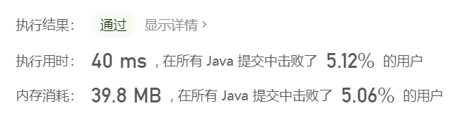

反转一个单链表。

示例:

```
输入: 1->2->3->4->5->NULL
输出: 5->4->3->2->1->NULL
```

进阶:
你可以迭代或递归地反转链表。你能否用两种方法解决这道题？

### 思路  迭代方法

指针node先迭代到倒数第二个元素`node.next.next = NULL`  然后让 `node.next.next = node, node.next = NULL` , 然后指针再指向首位 重复操作即可

### 代码实现

```java
class ListNode {
    int val;
    ListNode next;
    ListNode(int x) { val = x; }
}
class Solution {
    public ListNode reverseList(ListNode head) {
    	// 检验链表是否为空或只有一个元素
        if(head == null || head.next == null)
            return head;
        // 创建指针指向最后一个元素  即变化后的首元素
    	ListNode newHead = head;
    	while(newHead.next != null)
    		newHead = newHead.next;
    	// 创建指针  迭代到倒数第二位元素
    	ListNode node = head;
    	while(node.next.next != null)
    		node = node.next;
    	node.next.next = node;
    	node.next = null;   
    	node = head;
    	if (node.next != null)  // 说明倒排还没有完成
    		reverseList(node);  // 进行迭代

    	return newHead;   // 返回新的头节点

    }
}
```

结果  我这垃圾代码




### 官方解题

#### 迭代

```java
class Solution {
	public ListNode reverseList(ListNode head) {
		// 检验链表是否为空或只有一个元素 
        if(head == null || head.next == null)
            return head;
		ListNode pre = null;
		ListNode cur = head;
		while (cur != null){
            // 改变链表指向
			ListNode nextNode = cur.next;
			cur.next = pre;
			pre = cur;
			cur = nextNode;
		}
		return pre;
	}
}
```

**复杂度分析**

-   时间复杂度：O(n)*O*(*n*)，假设 n 是列表的长度，时间复杂度是 O(n)*O*(*n*)。
-   空间复杂度：O(1)*O*(1)。


#### 递归

```java
class Solution {
    public ListNode reverseList(ListNode head) {
        if (head == null || head.next == null) return head;
        ListNode p = reverseList(head.next);  // 递归
        head.next.next = head;
        head.next = null;
        return p;
    }
}
```

递归分析

```
reverseList: head=1
    reverseList: head=2
	|   reverseList: head=3
	|	|   reverseList:head=4
	|	|	|   reverseList:head=5 
	|	|	|	|	终止返回
	|	|	|	cur = 5
	|	|	|	4.next.next->4，即5->4
	|	|	cur=5
	|	|	3.next.next->3，即4->3
	|	cur = 5
	|	2.next.next->2，即3->2
	cur = 5
	1.next.next->1，即2->1
	
	最后返回cur
```

复杂度分析

时间复杂度：O(n)O(n)，假设 n 是列表的长度，那么时间复杂度为 O(n)
空间复杂度：O(n)，由于使用递归，将会使用隐式栈空间。递归深度可能会达到 n 层